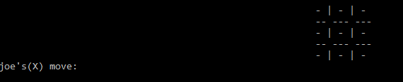
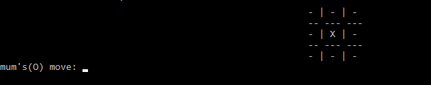
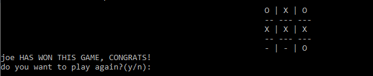

# TicTacToe
A simple tictactoe game made in c++

<center>

<br>


<br>

</center>

# Functionality
Currently you can only play 2 player mode and Human v/s Robot in this. Soon i'll be adding:
- [ ] Human v/s robot(but u can never win)
- [ ] Multiplayer mode(yeah that some tough shit)
# Change logs
### *9 April 2022:* 
+ *Added Human v/s Robot feature*
### *14 April 2022*
+ *Fixed a minor bug*
# Installation
To use this game,
+ Clone this repository by typing ```git clone https://github.com/ash-dodek/TicTacToe.git```
+ Open any of the code editor and run the ```main.cpp``` file.

# Contribution
Any contribution to this game is welcomed.
If you want to contribute to this repository, create a **[pull request](https://github.com/ash-dodek/TicTacToe/pulls)**

+ Somehow if you find any issues or bugs in the program please report them in the **[Issues](https://github.com/ash-dodek/TicTacToe/issues)** section